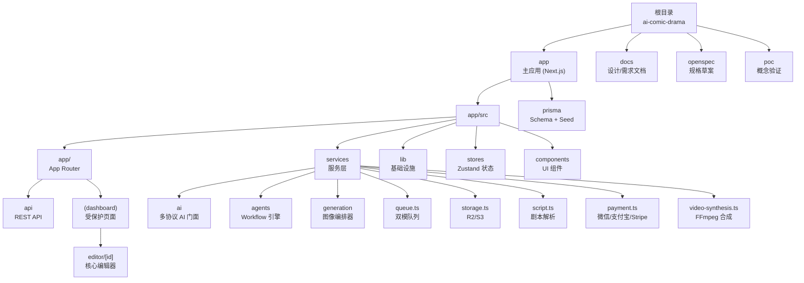
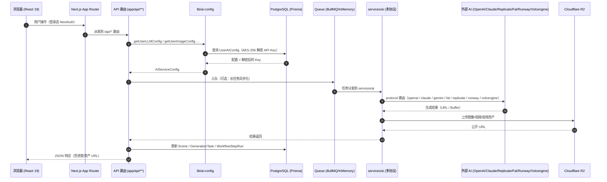

<!--
由 /ccg:init 生成（自适应架构师）
生成时间：2026-04-23 17:34:08 +08:00
执行者：Claude Code
说明：本文件是对根 CLAUDE.md 与 app/CLAUDE.md 的架构视图补充，
     聚焦「模块导航 + Mermaid 数据流图」，不覆盖既有手写内容。
-->

# 架构总览与模块导航

> 本文档为**只读导航层**，用于在根 CLAUDE.md 之外提供一个全局可点击的模块索引与数据流示意。
> 所有模块的详细职责请打开下方链接对应的模块级 `CLAUDE.md`。

## 项目一句话定位

**AI 漫剧工作台（AI Comic Drama Workbench）** —— 以 Next.js 16 + React 19 为核心的全栈应用，通过 7 步 AI 流水线将小说/故事文本转换为漫剧视频：
**文本输入 → 分镜解析 → 角色设置 → 图像生成 → 视频生成 → 语音合成 → 导出合成**。

## 模块结构图（可点击导航）

## 端到端数据流（Mermaid）

## 模块索引（一句话职责）

| 模块路径 | 一句话职责 | 模块文档 |
|----------|-----------|---------|
| `app/` | Next.js 16 主应用根（pnpm 工程入口） | [app/CLAUDE.md](./app/CLAUDE.md) |
| `app/src/app/` | App Router：页面 + API 路由 | [app/src/app/CLAUDE.md](./app/src/app/CLAUDE.md) |
| `app/src/app/api/` | 所有 REST 端点（projects / generate / auth / ai-configs / payment / workflow / export …） | [app/src/app/api/CLAUDE.md](./app/src/app/api/CLAUDE.md) |
| `app/src/app/(dashboard)/editor/[id]/` | 7 步流水线的核心编辑器（拆分后 ≈431 行编排 + 子组件与 hooks） | [app/src/app/(dashboard)/editor/[id]/CLAUDE.md](./app/src/app/(dashboard)/editor/[id]/CLAUDE.md) |
| `app/src/services/` | 业务服务层总索引 | [app/src/services/CLAUDE.md](./app/src/services/CLAUDE.md) |
| `app/src/services/ai/` | 统一 AI 门面：LLM / Image / Video / TTS 多协议分发 | [app/src/services/ai/CLAUDE.md](./app/src/services/ai/CLAUDE.md) |
| `app/src/services/agents/` | Hybrid Plan-and-Execute Workflow 引擎（7 步 Agent 管线） | [app/src/services/agents/CLAUDE.md](./app/src/services/agents/CLAUDE.md) |
| `app/src/services/generation/` | 图像生成编排器（策略选择 + 人脸一致性校验 + 重试） | [app/src/services/generation/CLAUDE.md](./app/src/services/generation/CLAUDE.md) |
| `app/src/lib/` | 基础设施：Auth / Encryption / Prisma / Logger / RateLimit / ContentSafety / Prompt | [app/src/lib/CLAUDE.md](./app/src/lib/CLAUDE.md) |
| `app/src/stores/` | Zustand 客户端状态（project / user） | [app/src/stores/CLAUDE.md](./app/src/stores/CLAUDE.md) |
| `app/src/components/` | React 组件 + shadcn/ui 原子组件 | [app/src/components/CLAUDE.md](./app/src/components/CLAUDE.md) |
| `app/prisma/` | Prisma Schema（19 个模型）+ 种子脚本 | [app/prisma/CLAUDE.md](./app/prisma/CLAUDE.md) |

## 变更记录 (Changelog)

| 日期 | 执行者 | 说明 |
|------|-------|------|
| 2026-04-23 | Claude Code (/ccg:init) | 首次生成架构总览 + 模块导航 + 12 份模块级 CLAUDE.md |
