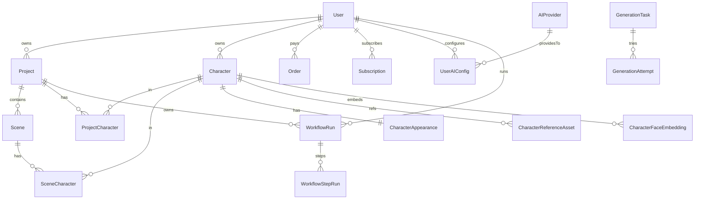

[根目录](../../../ARCHITECTURE.md) > [app](../../CLAUDE.md) > **prisma**

<!-- 由 /ccg:init 生成 | 时间：2026-04-23 17:34:08 +08:00 | 执行者：Claude Code -->

# prisma — 数据模型与种子

## 模块职责

Prisma 7 的数据模型定义（PostgreSQL），外加初始化种子脚本。覆盖：用户与鉴权、项目与分镜、角色体系、AI 配置、支付与订阅、Agent Workflow 运行时。

## 文件

| 文件 | 作用 |
|------|------|
| `schema.prisma` | **611 行**，19 个模型 + 多个 enum |
| `seed.ts` | 种子数据（通过 `pnpm db:seed` 调用 `npx tsx prisma/seed.ts`） |

## 数据模型总览（按领域）

### 1. 用户 / 鉴权

| 模型 | 要点 |
|------|------|
| `User` | id / email / password(hash) / name / image / emailVerified / credits(默认 100) / inviteCode(唯一) / invitedBy |
| `Account` | NextAuth OAuth 账户表；关联 `@@unique([provider, providerAccountId])` |
| `Session` | NextAuth 会话表 |
| `VerificationToken` | NextAuth 邮箱验证令牌 |
| `Checkin` | 每日签到 `@@unique([userId, date])`，默认积分 5 |
| `Invitation` | inviter/invitee 关系 + 50 积分奖励；`@@unique([inviterId, inviteeEmail])` |

### 2. 项目 / 分镜 / 角色

| 模型 | 要点 |
|------|------|
| `Project` | title / description / status(`ProjectStatus` enum: DRAFT/PROCESSING/COMPLETED/FAILED) / inputText(Text) / style(默认 anime) / aspectRatio(默认 9:16) |
| `Scene` | order / shotType / description / dialogue / narration / emotion / duration / imageUrl / videoUrl / audioUrl / imageStatus/videoStatus/audioStatus(`GenerationStatus` enum) / selectedCharacterId（旧单选） / selectedCharacterIds[]（新多选） |
| `Character` | name / gender / age / description(Text) / voiceId / voiceProvider / referenceImages[]（旧） + referenceAssets（新） |
| `CharacterAppearance` | 结构化外貌（hair/face/eye/body/height/skinTone/clothingPresets JSON/accessories/freeText） |
| `CharacterReferenceAsset` | 参考图资产：url / sourceType(upload/ai_generated/canonical) / isCanonical / pose / qualityScore / mimeType / w / h |
| `CharacterFaceEmbedding` | 512 维 ArcFace 向量 + modelVersion |
| `Tag` / `CharacterTag` | 角色标签（系统预设 + 用户自定义） |
| `ProjectCharacter` / `SceneCharacter` | 多对多关联；`SceneCharacter.dialogue` 存该角色在此场景的台词 |

### 3. 生成任务

| 模型 | 要点 |
|------|------|
| `GenerationTask` | type(`TaskType` enum: SCRIPT_PARSE/IMAGE_GENERATE/VIDEO_GENERATE/AUDIO_GENERATE/EXPORT) / status / input/output JSON / error / cost / projectId / sceneId |
| `GenerationAttempt` | 多次生成尝试：attemptNumber / provider / model / strategy(prompt_only/reference_edit/face_id) / seed / referenceAssetIds[] / similarityScores JSON / faceCount / passedValidation / failureReason / outputUrl |

### 4. 支付与订阅

| 模型 | 要点 |
|------|------|
| `Order` | orderNo(唯一) / type(`OrderType`: CREDITS/SUBSCRIPTION) / productId / amount / credits / status(`OrderStatus`: PENDING/PAID/CANCELLED/REFUNDED/EXPIRED) / paymentMethod(`PaymentMethod`: WECHAT/ALIPAY/STRIPE) / paymentId / paidAt / subscriptionId / expiresAt |
| `Subscription` | planId / planName / status(`SubscriptionStatus`: ACTIVE/CANCELLED/EXPIRED/PAST_DUE) / currentPeriodStart/End / creditsPerPeriod / lastCreditAt / cancelledAt / cancelReason |

### 5. AI 模型配置

| 模型 | 要点 |
|------|------|
| `AIProvider` | name / slug(唯一) / category(`AICategory`: LLM/IMAGE/VIDEO/TTS) / baseUrl / apiProtocol / models(JSON) / configSchema(JSON) / isActive / isCustom / userId(自定义归属) |
| `UserAIConfig` | apiKey(AES-256 加密密文) + apiKeyIv / customBaseUrl / apiProtocol / customModels(JSON) / extraConfig(JSON) / selectedModel / authType(`AuthType`: API_KEY/CHATGPT_TOKEN/OAUTH) / tokenExpiresAt / isEnabled / isDefault / lastTestedAt / testStatus(`TestStatus`: SUCCESS/FAILED/PENDING) |
| `UserGenerationPreference` | defaultLLM/Image/Video/TTS / concurrencyMode(`ConcurrencyMode`: SERIAL/PARALLEL) / maxConcurrent(默认 3) |

### 6. Agent Workflow

| 模型 | 要点 |
|------|------|
| `WorkflowRun` | projectId / userId / status(`WorkflowStatus`: PENDING/RUNNING/COMPLETED/FAILED/PAUSED) / currentStep / config(JSON) / artifacts(JSON) / error / startedAt / completedAt |
| `WorkflowStepRun` | workflowRunId / step / agentName / status / input/output JSON / reasoning(Text) / attempts / tokensUsed / error / startedAt / completedAt |

## 关系图（主要外键）



## 命令

```bash
pnpm db:generate   # 生成 Prisma Client（prisma generate）
pnpm db:seed       # 运行 seed 脚本
npx prisma db push # 同步 schema 到数据库（开发）
npx prisma migrate # 生产迁移流程（建议启用）
```

## 扩展点 / 常见坑

- **Migration 策略**：当前 README/CI 未显式使用 `prisma migrate`；在向生产推广前建议切换到 migrate。
- **枚举扩展**：Prisma 枚举（`ProjectStatus` / `OrderStatus` …）扩值需要 `migrate`；避免直接改字面量破坏旧数据。
- **JSON 字段**：`artifacts / config / output / extraConfig` 使用 `Prisma.InputJsonValue`；写入时必要 `JSON.parse(JSON.stringify(obj))` 保证 Date/Buffer 等被序列化。
- **选择向量列**：`CharacterFaceEmbedding.embedding: Float[]`（Prisma 7 + PostgreSQL 的 `double precision[]`），不是 pgvector；若要相似度近邻检索需要在应用层做/迁移到 pgvector。
- **向后兼容字段**：`Character.referenceImages[]`（旧） vs `CharacterReferenceAsset`（新） / `Scene.selectedCharacterId`（旧） vs `selectedCharacterIds[]`（新）—— 读写时注意同步。
- **级联删除**：大量 `onDelete: Cascade`，删除 User 会连带清除 Project / Character / Orders 等，生产慎用硬删。

## 变更记录 (Changelog)

| 日期 | 说明 |
|------|------|
| 2026-04-23 | 首次生成（/ccg:init 自适应架构师）；覆盖 611 行 schema 的全部 19 个模型 |
