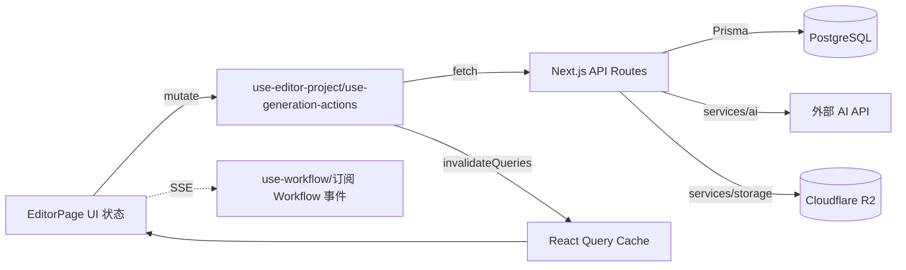

[根目录](../../../../../../ARCHITECTURE.md) > [app](../../../../CLAUDE.md) > [src](../../../CLAUDE.md) > [app](../../CLAUDE.md) > [(dashboard)](../../) > [editor](../) > **[id]**

<!-- 由 /ccg:init 生成 | 时间：2026-04-23 17:34:08 +08:00 | 执行者：Claude Code -->

# editor/[id] — 编辑器核心页面

## 模块职责

**整个项目最复杂的页面**：把 7 步 AI 流水线（文本 → 分镜 → 角色 → 图 → 视频 → 音 → 导出）组装到一个可交互视图中。页面本体经重构后 **≈431 行**，通过拆分子组件 + hooks 将逻辑下沉，避免单文件膨胀。

## 入口与启动

| 文件       | 作用                                                          |
| ---------- | ------------------------------------------------------------- |
| `page.tsx` | 编辑器入口，`EditorPage` 默认导出；仅承担 UI 编排与对话框状态 |

URL：`/editor/[id]`，`params.id` 为项目 ID。

## 目录结构

```
editor/[id]/
├── page.tsx                         # 顶层编排（~431 行）
├── components/                      # UI 子组件
│   ├── EditorHeader.tsx             # 标题、工具栏、导出/预览按钮
│   ├── ScriptPanel.tsx              # 左栏：原文输入 + 解析按钮 + 工作流启动
│   ├── SceneList.tsx                # 中栏：分镜卡片列表 + 批量生成
│   ├── SceneEditor.tsx              # 右栏：选中分镜的详情与图像生成
│   ├── WorkflowPanel.tsx            # 底部浮层：Workflow 运行进度
│   ├── ExportDialog.tsx             # 导出弹窗（含进度轮询显示）
│   └── CharacterManagerDialog.tsx   # 角色管理弹窗
└── hooks/                           # 业务 hooks
    ├── use-editor-project.ts        # 项目/场景 CRUD + React Query
    ├── use-generation-actions.ts    # 图/视/音生成 mutation
    └── use-workflow.ts              # SSE 工作流订阅
```

## 核心对象

### `useEditorProject(projectId)` — 项目数据层

暴露：`project / isLoading / error / selectedScene / selectedSceneId / inputText / editingTitle / title / allCharacters / selectedCharacterIds / showCharacterManager / queryClient / invalidateProject / parseMutation / updateSceneMutation / updateCharactersMutation / updateTitleMutation / handleSceneDurationChange / setInputText / setEditingTitle / setTitle / setSelectedSceneId / setSelectedCharacterIds / setShowCharacterManager`。

### `useGenerationActions(projectId, project)` — 生成动作层

暴露：`generateImageMutation / generateVideoMutation / generateAudioMutation / batchGenerateImagesMutation / invalidateProject`。

- `generateSceneImage(projectId, sceneId, prompt, { imageConfigId })` 为独立函数，供"多配置并行生成"复用。

### `useWorkflow(projectId)` — Agent Workflow 订阅

暴露：`start(inputText, cfg) / cancel / status / events / isRunning / error`。内部订阅 `/api/projects/[id]/workflow`（SSE）。

## 对外接口（调用的 API）

| API                                              | 触发位置                        |
| ------------------------------------------------ | ------------------------------- |
| `GET /api/projects/:id`                          | 进入页面时加载                  |
| `PATCH /api/projects/:id`                        | 标题、风格、比例修改            |
| `POST /api/script/parse`                         | ScriptPanel "解析"按钮          |
| `POST /api/projects/:id/scenes`                  | 保存解析结果                    |
| `POST /api/generate/image`                       | 单分镜/批量图像生成、多配置并行 |
| `POST /api/generate/video`                       | 视频生成（多配置对话框）        |
| `POST /api/generate/tts`                         | 语音合成（多配置对话框）        |
| `POST /api/projects/:id/export` + `GET ?taskId=` | 导出 + 轮询                     |
| `POST /api/projects/:id/workflow`                | 启动 Workflow                   |

## 数据流



## 关键依赖

- `@/components/timeline-editor` —— 底部时间轴
- `@/components/preview-player` —— 预览对话框内的播放器
- `@/components/ai-models/MultiGenerateDialog` —— 多 AI 配置批量生成对话框
- `@tanstack/react-query` —— 所有 API 调用都经过 React Query（`useQuery` + `useMutation` + `invalidateQueries`）

## 扩展点 / 常见坑

- **新增一个生成类别**（例如"音效"）：
  1. `use-generation-actions.ts` 新增 mutation
  2. `SceneEditor.tsx` / `SceneList.tsx` 暴露按钮
  3. `MultiGenerateDialog` 的 `category` 枚举补充
  4. 后端新增 `/api/generate/<type>/route.ts`
- **多配置并行**：由 `MultiGenerateDialog` 的 `mode: "PARALLEL" | "SERIAL"` 控制，上层是 `Promise.allSettled` / 串行 `for await`。
- **导出进度轮询**：见 `pollExportProgress`，每 2s 轮询；失败条件：`status === "failed"` 或 `fetch` 抛错。
- **页面拆分约定**：单个子组件原则上 < 300 行；hooks 返回的字段要显式命名，避免回传 `any`。

## 测试与质量

- 无单测/E2E；依赖手动验证。
- Lint 规则：禁止 `@typescript-eslint/no-explicit-any`（个别位置用 `as any` + 注释豁免，需审慎）。

## 相关文件清单

- `page.tsx`（431 行）
- `components/*.tsx`（7 份子组件）
- `hooks/*.ts`（3 份 hooks）

## 变更记录 (Changelog)

| 日期       | 说明                                                       |
| ---------- | ---------------------------------------------------------- |
| 2026-04-23 | 首次生成（/ccg:init 自适应架构师）；记录重构后 ~431 行结构 |
