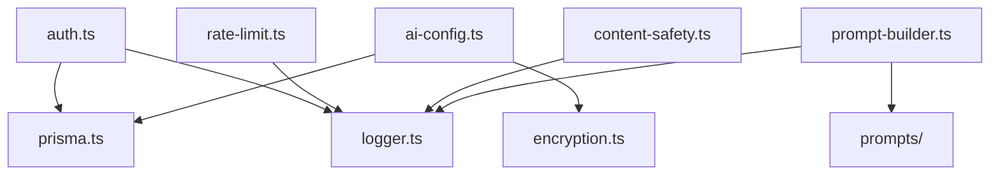

[根目录](../../../../ARCHITECTURE.md) > [app](../../../CLAUDE.md) > [src](../../CLAUDE.md) > **lib**

<!-- 由 /ccg:init 生成 | 时间：2026-04-23 17:34:08 +08:00 | 执行者：Claude Code -->

# lib — 基础设施工具层

## 模块职责

**与具体业务无关**的底层能力：认证、加密、DB 客户端、日志、限流、内容安全、Prompt 构建。所有模块都可被任意上层（API / services / components）引用，但反向不允许。

## 关键文件

| 文件 | 职责 | 关键导出 |
|------|------|---------|
| `auth.ts` | NextAuth v5 配置 + `registerUser` 业务 | `handlers / auth / signIn / signOut / registerUser` |
| `prisma.ts` | Prisma Client 单例 | `prisma` |
| `encryption.ts` | AES-256-GCM 加/解密 | `encrypt / decrypt / generateEncryptionKey / maskApiKey` |
| `ai-config.ts` | 查询用户 AI 配置并解密 API Key | `getUserLLMConfig / getUserImageConfig / getUserVideoConfig / getUserTTSConfig` |
| `logger.ts` | 带上下文的日志器 | `logger / createLogger(context)` |
| `rate-limit.ts` | 滑动窗口限流（Memory/Redis） | `rateLimiters / rateLimitHeaders / RateLimitConfig / RateLimitResult` |
| `content-safety.ts` | 内容安全审核（关键词 + 专业 API） | `contentSafetyMiddleware / ContentCheckResult / ImageCheckResult` |
| `prompt-builder.ts` | 增强图像 prompt（角色固定特征 + 场景分析） | `buildEnhancedPrompt / buildSceneAnalysisPrompt / parseSceneAnalysisResponse` |
| `prompts/index.ts` | Prompt 模板集中导出 | `SCRIPT_PARSE_SYSTEM / buildScriptParseUserPrompt / getStylePrefix / getShotTypeDescription / getSimpleStylePrefix` |

## 对外接口摘录

### `auth.ts`

```ts
export const { handlers, auth, signIn, signOut } = NextAuth({ ... });

// 凭据登录：email + password + bcrypt.compare
// Session 策略：JWT，callback 中把 user.id 注入 token 与 session
// 页面：signIn: "/login"
// 邀请码：注册时从 cookie 读 invite_code，创建 Invitation 记录并给邀请人加 50 积分

registerUser(email, password, name?)
  : Promise<{ success; error?; userId? }>
```

### `encryption.ts`

```ts
// AES-256-GCM，ENCRYPTION_KEY 必须 64 hex（32 字节）
encrypt(text): { encrypted, iv }          // 密文尾部附带 16 字节 authTag
decrypt(encrypted, iv): string
generateEncryptionKey(): string           // 用于初始化项目时生成密钥
maskApiKey(apiKey, showChars = 4): string // 显示前/后 N 位，中间用 * 填充
```

### `ai-config.ts`

```ts
getUserLLMConfig(userId)   : Promise<AIServiceConfig | null>
getUserImageConfig(userId) : Promise<AIServiceConfig | null>
getUserVideoConfig(userId) : Promise<AIServiceConfig | null>
getUserTTSConfig(userId)   : Promise<AIServiceConfig | null>

// 查询顺序：isDefault=true → 最早创建的 enabled 配置
// Base URL：customBaseUrl > provider.baseUrl > ""
// 返回 config.protocol 优先 config.apiProtocol > provider.apiProtocol
```

### `logger.ts`

```ts
createLogger("api:generate:image") → { debug, info, warn, error }
// 由 process.env.LOG_LEVEL 控制（默认 info）
// 格式：[ISO时间] [LEVEL] [context] message ...args
```

### `rate-limit.ts`

```ts
// 滑动窗口；Memory（开发）+ Redis（生产）自动切换
// 预定义：rateLimiters.imageGeneration / videoGeneration / ttsGeneration / scriptParse / upload …
rateLimiters.imageGeneration(request, userId)
  : Promise<{ success, limit, remaining, reset, retryAfter? }>

rateLimitHeaders(result): Record<string,string>
```

### `content-safety.ts`

```ts
contentSafetyMiddleware(text, kind: "text"|"image")
  : Promise<{ safe, reason?, blockedKeywords?, sanitizedText?,
              riskLevel?: "pass"|"review"|"block", labels?, suggestion? }>
// 基础版：本地关键词 + 敏感词替换
// 进阶：可接入阿里云/腾讯云内容审核 API
```

### `prompt-builder.ts`

```ts
buildEnhancedPrompt({ style?, characters, analysis, shotType?, originalPrompt? })
  : string
// 将角色 description（含外貌/服装/发型/饰品）置于 prompt 前部作为固定特征
// 动作/表情/姿态由 SceneAnalysis 驱动

buildSceneAnalysisPrompt(scene, characters) : string
parseSceneAnalysisResponse(text) : SceneAnalysis
```

## 依赖拓扑



## 测试与质量

- 无单测；敏感逻辑（`encryption.ts`）建议补测。
- `ENCRYPTION_KEY` 校验在启动时抛错；缺失立即发现。

## 扩展点 / 常见坑

- **密钥轮换**：`ENCRYPTION_KEY` 一旦变更，所有已加密的 `UserAIConfig.apiKey` 全部不可用；必须先批量用旧密钥解密→用新密钥重加密。
- **时钟漂移**：JWT session 有时钟要求；部署时服务器时间偏差 >5min 会导致登录失效。
- **限流存储**：内存存储**每进程独立**，Serverless 多实例下不准确；生产必须 Redis。
- **Prompt 模板单点**：所有系统级 prompt 集中在 `prompts/`；修改会全局生效。

## 变更记录 (Changelog)

| 日期 | 说明 |
|------|------|
| 2026-04-23 | 首次生成（/ccg:init 自适应架构师） |
