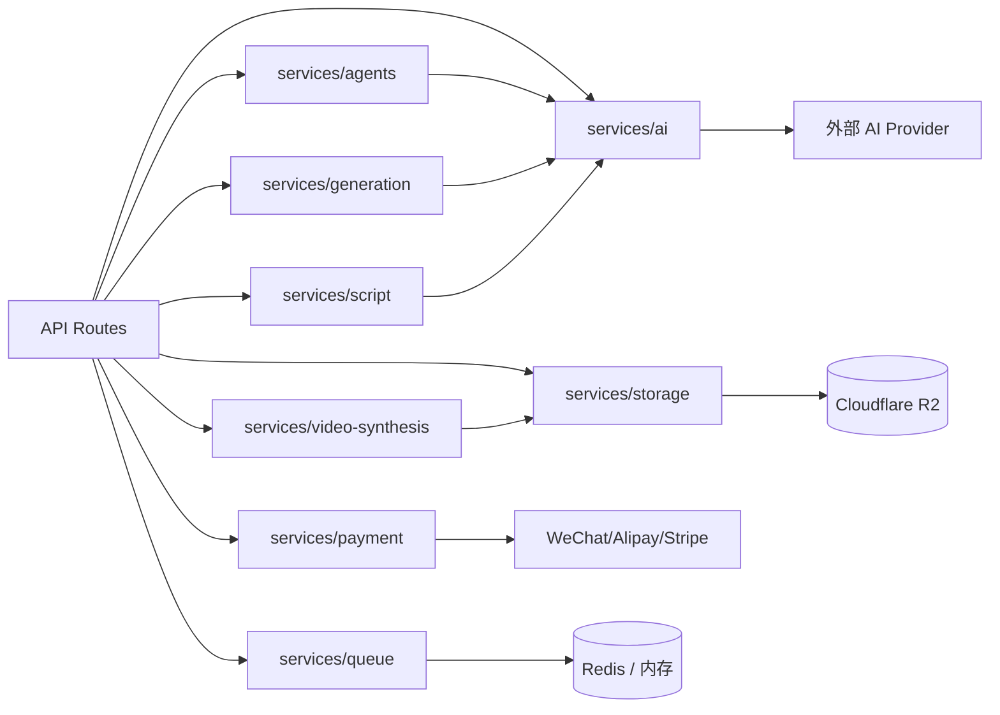

[根目录](../../../../ARCHITECTURE.md) > [app](../../../CLAUDE.md) > [src](../../CLAUDE.md) > **services**

<!-- 由 /ccg:init 生成 | 时间：2026-04-23 17:34:08 +08:00 | 执行者：Claude Code -->

# services — 业务服务层总索引

## 模块职责

承载**与业务强相关的服务层代码**，在 API 路由与基础 lib 之间做领域编排。按职责拆分为：

| 子模块/文件 | 职责 | 文档 |
|------------|------|------|
| `ai/` | 多协议 AI 门面（LLM / Image / Video / TTS） | [ai/CLAUDE.md](./ai/CLAUDE.md) |
| `agents/` | Agent 管线引擎（Plan-and-Execute，7 步 Workflow） | [agents/CLAUDE.md](./agents/CLAUDE.md) |
| `generation/` | 图像生成编排器（策略 + 人脸一致性 + 重试） | [generation/CLAUDE.md](./generation/CLAUDE.md) |
| `queue.ts` | 双模任务队列：BullMQ（Redis）/ InMemoryQueue | — |
| `script.ts` | 剧本解析（直接走 LLM + 可选 ScriptParserAgent） | — |
| `storage.ts` | Cloudflare R2 / S3 文件上传、签名 URL | — |
| `payment.ts` | 微信支付 / 支付宝 / Stripe | — |
| `video-synthesis.ts` | FFmpeg 视频合成导出 | — |

## 关键约定

1. **服务层不直接处理 HTTP**：由 API 路由调用；所有函数接受纯数据参数并返回纯数据/Promise。
2. **日志**：每个文件开头 `const log = createLogger("services:<name>")`，禁止 `console.*`。
3. **错误**：失败必须抛 `Error`（或子类），由 API 层转 HTTP 响应。
4. **Config 注入**：AI 调用统一走 `AIServiceConfig`（protocol + baseUrl + apiKey + model）；调用方使用 `lib/ai-config` 从 DB 获取。

## 服务地图

## queue.ts 关键速览

- **双模**：`process.env.REDIS_URL` 存在则用 `BullMQQueue`，否则 `InMemoryQueue`
- **预置队列**：`generationQueue`（并发 3，超时 10 分钟） + `exportQueue`（并发 1，超时 30 分钟）
- **入队 API**：`addImageGenerationJob` / `addVideoGenerationJob` / `addAudioGenerationJob` / `addExportJob`
- **任务类型**：`image:generate | video:generate | audio:generate | export:video | content:check`
- **内存队列能力**：`concurrency / maxRetries / retryDelay / timeout`，重试失败进入 `failed` 状态

## script.ts 关键速览

- `parseScript(text, config?)` —— 直接调用 LLM，返回 `ParsedScript`（从 response 中正则提取 JSON）
- `parseScriptWithAgent(text, config?)` —— 使用 `ScriptParserAgent`（含 Zod 校验 + 自修复）
- `generateImagePrompt(scene, characters, style)` —— 拼接图像 prompt（风格 + 场景描述 + 角色描述 + 景别 + 情绪）

## storage.ts 关键速览

- `r2Client` —— `S3Client`，使用 `R2_ENDPOINT` / `R2_ACCESS_KEY_ID` / `R2_SECRET_ACCESS_KEY` / `R2_BUCKET_NAME`
- 文件路径规则：`${userId}/${projectId}/${fileType}s/${timestamp}_${baseName}.${ext}`
- 关键函数：`uploadFile / uploadFileFromUrl / getSignedUrl / deleteFile / isStorageConfigured`
- `FileType = "image" | "video" | "audio"`

## payment.ts 关键速览

- 商品目录：`CREDIT_PACKAGES`（trial/basic/pro）、`SUBSCRIPTION_PLANS`（monthly/yearly）
- 支付方式：`"WECHAT" | "ALIPAY" | "STRIPE"`
- 统一返回：`PaymentResult { success, orderId, paymentUrl?, qrCode?, prepayId?, error? }`

## video-synthesis.ts 关键速览

- 使用 `child_process.spawn("ffmpeg", ...)`
- 质量预设：`480p / 720p / 1080p`
- 比例：`9:16 / 16:9 / 1:1`
- 能力：下载远程资产到 `os.tmpdir()/ai-comic-export`，按分镜拼接，支持字幕/音频开关

## 常见坑

- **环境变量缺失**：`R2_*` 未配置时 `storage.ts` 上传会静默失败；`REDIS_URL` 未配置时自动降级内存队列（**Serverless 冷启动会丢失队列**）。
- **AI 配置降级**：图像生成在用户配置失败时，若 `REPLICATE_API_TOKEN` 存在会自动 fallback（见 `ai/index.ts#shouldFallbackToEnvReplicate`）。
- **FFmpeg 未安装**：`video-synthesis.ts` 运行失败时要检查系统 FFmpeg 可用性。

## 变更记录 (Changelog)

| 日期 | 说明 |
|------|------|
| 2026-04-23 | 首次生成（/ccg:init 自适应架构师） |
