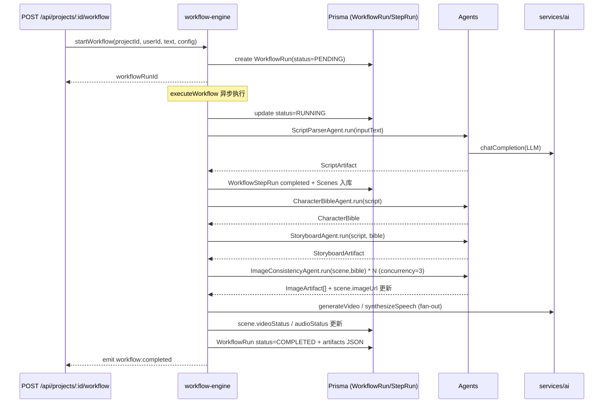

[根目录](../../../../../ARCHITECTURE.md) > [app](../../../../CLAUDE.md) > [src](../../../CLAUDE.md) > [services](../CLAUDE.md) > **agents**

<!-- 由 /ccg:init 生成 | 时间：2026-04-23 17:34:08 +08:00 | 执行者：Claude Code -->

# services/agents — Hybrid Plan-and-Execute Workflow 引擎

## 模块职责

以 **Plan-and-Execute 混合模式** 实现 7 步 AI 工作流：
`parse_script → build_character_bible → build_storyboard → generate_images → generate_videos → generate_audios → export`。
每步由独立 Agent 实现，主控由 `workflow-engine.ts` 持有，任务状态持久化到 `WorkflowRun / WorkflowStepRun` 表，并通过 SSE 事件实时推送进度。

## 入口与启动

| 文件 | 作用 |
|------|------|
| `workflow-engine.ts` | 调度器：`startWorkflow / getWorkflowStatus / cancelWorkflow / subscribeWorkflowEvents` |
| `types.ts` | `Agent / WorkflowConfig / WorkflowContext / WorkflowEvent / ArtifactStore / Artifact …` |
| `script-parser-agent.ts` | Step 1：文本 → `ScriptArtifact`（含 Zod 校验 + 自修复） |
| `character-bible-agent.ts` | Step 2：角色圣经（外貌/一致性约束） |
| `storyboard-agent.ts` | Step 3：分镜补全（shotType / emotion / duration） |
| `image-consistency-agent.ts` | Step 4：单分镜图像生成（含一致性策略） |

## 对外接口

```ts
// 启动一个新 workflow（异步，立即返回 runId）
startWorkflow(projectId, userId, inputText, config: WorkflowConfig): Promise<string>

// 查询当前状态（含 steps 列表与 progress 百分比）
getWorkflowStatus(workflowRunId): Promise<WorkflowStatus | null>

// 取消
cancelWorkflow(workflowRunId): Promise<void>

// 订阅事件（SSE 使用）
subscribeWorkflowEvents(workflowRunId, listener): () => void   // 返回退订函数
```

## 核心类型

```ts
interface WorkflowConfig {
  llm?: AIServiceConfig;
  image?: AIServiceConfig;
  video?: AIServiceConfig;
  tts?: AIServiceConfig;
  mode: "auto" | "step_by_step";
  maxImageReflectionRounds: number;
  style: string;
}

interface WorkflowContext {
  workflowRunId: string;
  projectId: string;
  userId: string;
  config: WorkflowConfig;
  artifacts: ArtifactStore;     // In-Memory Artifact 容器
  emit: (event: WorkflowEvent) => void;
}

interface Agent<TInput, TOutput> {
  readonly name: string;
  run(input: TInput, context: WorkflowContext)
    : Promise<{ success; data?; error?; reasoning?; attempts; tokensUsed }>;
}
```

## 工作流执行序列



## 事件体系

| 事件类型 | 时机 |
|---------|------|
| `workflow:started` | run 变 RUNNING |
| `step:started` | 进入某个 step |
| `step:completed` / `step:failed` | Agent.run 完成 |
| `progress:update` | 图像批次完成时 |
| `workflow:completed` / `workflow:failed` | 终止态 |

订阅者通过 `subscribeWorkflowEvents` 注册 listener；API 层封装为 SSE 流供前端 `use-workflow` 消费。

## 关键数据持久化

| DB 表 | 字段 |
|-------|------|
| `WorkflowRun` | id / projectId / userId / status / currentStep / config(JSON) / artifacts(JSON) / error / startedAt / completedAt |
| `WorkflowStepRun` | id / workflowRunId / step / agentName / status / input(JSON) / output(JSON) / reasoning / attempts / tokensUsed / error / startedAt / completedAt |

`artifacts` 字段是 `InMemoryArtifactStore.toJSON()` 的序列化结果，**每步完成后与终态时都会刷写**。

## 关键依赖

- `@/lib/prisma` —— DB 持久化
- `@/services/ai` —— Agent 内部调用 LLM / Image / Video / TTS
- `@/lib/logger`

## 扩展点

**新增一步（例如 "review_script"）**：

1. 新建 `review-script-agent.ts` 实现 `Agent<Input, Output>`
2. `types.ts#WorkflowStep` 增加字面量
3. `workflow-engine.ts#executeWorkflow` 在对应位置插入 `executeAgentStep(...)`
4. 若产出新 Artifact，`ArtifactType` 中加类型
5. 前端 `WorkflowPanel` 增加步骤显示

## 常见坑

- **In-Memory Artifact**：当前 `InMemoryArtifactStore` 随 process 销毁丢失；仅终态序列化进 DB。若需要跨进程恢复，要自行反序列化重建。
- **并发控制**：图像生成写死 `concurrency = 3`；要调整需直接改 `executeImageGeneration`。
- **步骤失败传播**：`scriptResult.success === false` 会 `throw new Error(...)`，进入 catch 后整个 workflow 置 FAILED；中间步骤不做自动回滚，已入库的 Scene 会残留。
- **tokensUsed 字段**：各 Agent 需自行计数；未计数则为 0。

## 相关文件清单

- `workflow-engine.ts`（574 行）
- `types.ts`
- `script-parser-agent.ts` / `character-bible-agent.ts` / `storyboard-agent.ts` / `image-consistency-agent.ts`

## 变更记录 (Changelog)

| 日期 | 说明 |
|------|------|
| 2026-04-23 | 首次生成（/ccg:init 自适应架构师） |
