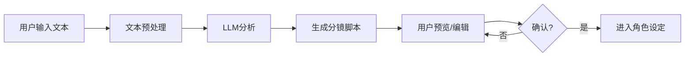
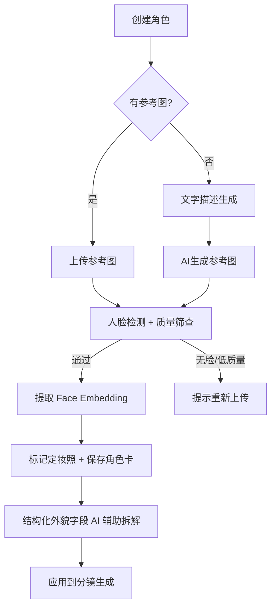
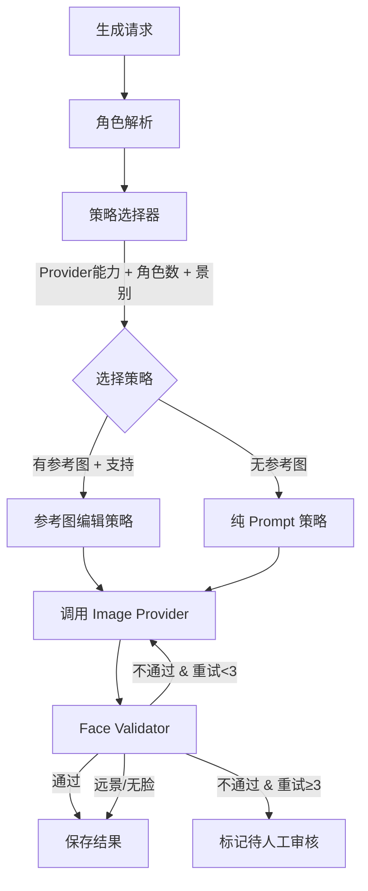
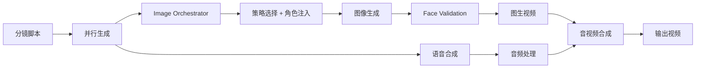

# AI漫剧 (AI Comic Drama) 产品需求文档

## 1. 文档信息

| 版本号 | 创建日期 | 负责人 | 状态 |
|--------|----------|--------|------|
| V1.2 | 2026-03-18 | - | 角色一致性系统完善 + 生成管线编排器 |
| V1.1 | 2026-03-18 | - | 架构重构 (类型系统/Provider Factory/页面拆分/Prompt模板) |
| V1.0 | 2026-01-02 | - | 初始版本 |

## 2. 名词解释

| 术语 | 解释 |
|------|------|
| 漫剧 | 结合漫画分镜与短视频形式的内容载体，通常配有配音、BGM和字幕 |
| 分镜 | 将故事拆解为单个画面的脚本单元，包含画面描述、对话、景别等 |
| 角色一致性 | 同一角色在不同分镜中保持相同的外貌特征 |
| LoRA | Low-Rank Adaptation，轻量化模型微调技术，用于保持角色一致性 |
| IP-Adapter | 图像提示适配器，通过参考图保持生成图像的风格/人物一致性 |
| TTS | Text-to-Speech，文字转语音技术 |
| 推文 | 短视频平台上的小说改编视频内容 |

## 3. 产品概述

### 3.1 产品背景

#### 市场现状
- **内容爆发**：抖音/快手上"小说推文"日均播放量超10亿，番茄小说、知乎盐选等平台积累海量IP
- **工具割裂**：创作者需在 ChatGPT（剧本）→ Midjourney（出图）→ 可灵/Runway（视频）→ ElevenLabs（配音）→ 剪映（剪辑）之间反复跳转
- **效率瓶颈**：制作一条3分钟漫剧视频，熟练创作者需要4-8小时

#### 问题与机会
| 痛点 | 影响 | 机会 |
|------|------|------|
| 流程割裂 | 数据不互通，重复操作多 | 一站式工作流整合 |
| 角色崩坏 | 第1镜和第10镜主角判若两人 | 角色一致性系统 |
| 学习成本高 | 需掌握多个AI工具的Prompt技巧 | 封装复杂度，降低门槛 |
| 成本不可控 | 反复生成导致API费用失控 | 预览-确认-生成的分级机制 |

#### 为什么是现在
- Flux/SDXL 图像质量已达商用水平
- 可灵/Runway 视频生成成本持续下降
- IP-Adapter/PuLID 等角色一致性技术趋于成熟
- 短视频平台对优质内容的需求持续增长

### 3.2 产品目标

#### 业务目标
| 指标 | MVP目标 (3个月) | 中期目标 (6个月) |
|------|-----------------|------------------|
| 注册用户 | 1,000 | 10,000 |
| 付费转化率 | 5% | 10% |
| 作品生成量 | 5,000条 | 50,000条 |
| 用户留存(7日) | 30% | 45% |

#### 用户目标
- **创作者**：将制作一条漫剧的时间从4小时缩短到30分钟
- **读者**：发现和消费高质量AI生成漫剧内容

### 3.3 目标用户

#### 用户画像

**P0 - 核心用户：小说推文创作者**
- 年龄：22-35岁
- 特征：有一定AI工具使用经验，在抖音/快手发布推文内容
- 痛点：效率低、角色不一致、工具切换繁琐
- 付费意愿：高（内容可直接变现）

**P1 - 重要用户：网文作者/编剧**
- 年龄：25-40岁
- 特征：有创作能力，希望将文字作品可视化
- 痛点：不会画画、不懂视频制作
- 付费意愿：中

**P2 - 潜在用户：普通内容消费者**
- 年龄：18-30岁
- 特征：喜欢看漫剧/推文，偶尔想自己创作
- 痛点：创作门槛高
- 付费意愿：低

### 3.4 用户痛点

#### 核心痛点验证

**痛点1：流程割裂，效率低下**
> "我每天要在5个软件之间来回切换，光是复制粘贴Prompt就要花半小时"
> —— 抖音推文创作者，粉丝12万

**痛点2：角色一致性差**
> "女主第一集是长发，第三集就变短发了，评论区全在吐槽"
> —— 快手漫剧账号运营

**痛点3：成本不可控**
> "上个月Midjourney花了800美金，很多图生成出来根本用不了"
> —— 独立创作者

**痛点4：学习曲线陡峭**
> "光是学会写好Prompt就花了我两周，还要学ComfyUI、学剪辑..."
> —— 转型中的网文作者

### 3.5 竞品分析

| 维度 | LTX Studio | DomoAI | 必剪 | 我们的机会 |
|------|------------|--------|------|------------|
| 角色一致性 | ⭐⭐⭐⭐⭐ | ⭐⭐⭐ | ⭐⭐ | 做到⭐⭐⭐⭐ |
| 中文支持 | ⭐⭐ | ⭐⭐⭐ | ⭐⭐⭐⭐⭐ | 原生中文 |
| 全链路整合 | ⭐⭐⭐⭐ | ⭐⭐ | ⭐⭐⭐ | 端到端 |
| 价格 | $$$$ | $$ | 免费 | $$ |
| 学习成本 | 高 | 中 | 低 | 低 |

**差异化定位**：专注中文小说→漫剧的垂直场景，提供端到端的一站式解决方案

---

## 4. 功能需求

### 4.1 功能架构

```
┌─────────────────────────────────────────────────────────────┐
│                      AI漫剧工作台                            │
├─────────────┬─────────────┬─────────────┬─────────────────┤
│  剧本引擎   │  角色系统   │  生成管线   │   编辑器        │
├─────────────┼─────────────┼─────────────┼─────────────────┤
│ • 文本输入  │ • 角色卡    │ • 图像生成  │ • 分镜预览      │
│ • 智能拆解  │ • 一致性    │ • 视频生成  │ • 时间轴        │
│ • 分镜脚本  │ • 表情姿态  │ • 语音合成  │ • 音画同步      │
│ • 对话提取  │ • 服装管理  │ • BGM匹配   │ • 导出发布      │
└─────────────┴─────────────┴─────────────┴─────────────────┘
```

### 4.2 功能清单与优先级

| 功能模块 | 功能点 | 优先级 | MVP |
|----------|--------|--------|-----|
| **剧本引擎** | 文本/大纲输入 | P0 | ✅ |
| | 智能分镜拆解 | P0 | ✅ |
| | 分镜脚本编辑 | P0 | ✅ |
| **角色系统** | 角色卡创建 | P0 | ✅ |
| | 角色一致性生成 | P0 | ✅ |
| | 多角色管理 | P1 | ✅ |
| **图像生成** | 分镜图片生成 | P0 | ✅ |
| | 风格选择 | P0 | ✅ |
| | 重新生成/微调 | P1 | ✅ |
| **视频生成** | 图生视频 | P0 | ✅ |
| | 镜头运动控制 | P2 | ❌ |
| **语音合成** | 多角色配音 | P0 | ✅ |
| | 旁白生成 | P1 | ✅ |
| | 情感控制 | P2 | ❌ |
| **编辑器** | 分镜预览 | P0 | ✅ |
| | 时间轴编辑 | P1 | ✅ |
| | 音画自动对齐 | P1 | ✅ |
| | BGM库 | P2 | ❌ |
| **导出** | 视频导出 | P0 | ✅ |
| | 多比例支持 | P1 | ✅ |
| | 字幕烧录 | P1 | ✅ |
| **用户系统** | 注册登录 | P0 | ✅ |
| | 作品管理 | P0 | ✅ |
| | 积分系统 | P0 | ✅ |

---

### 4.3 核心功能详细设计

#### 4.3.1 剧本拆解引擎

**功能概述**
用户输入小说文本或故事大纲，系统自动拆解为结构化的分镜脚本。

**用户场景**
> 小王是一名推文创作者，他从番茄小说复制了一段3000字的爽文片段。他将文本粘贴到输入框，点击"智能拆解"，30秒后系统生成了15个分镜的脚本表格，包含每个镜头的画面描述、角色、对话和景别建议。

**输入输出**

| 输入 | 输出 |
|------|------|
| 小说文本 (≤10000字) | 分镜脚本表格 |
| 或 故事大纲 (≤2000字) | JSON结构化数据 |

**分镜脚本结构**
```json
{
  "title": "霸道总裁爱上我 第1集",
  "scenes": [
    {
      "id": 1,
      "shot_type": "中景",
      "description": "现代都市CBD，玻璃幕墙大厦前，女主林萧穿着职业装匆忙走过",
      "characters": ["林萧"],
      "dialogue": null,
      "narration": "这是林萧来到A市的第三年",
      "emotion": "平静",
      "duration": 3
    },
    {
      "id": 2,
      "shot_type": "特写",
      "description": "电梯门打开，男主陆景琛西装革履走出，眼神冷峻",
      "characters": ["陆景琛"],
      "dialogue": null,
      "narration": "而他，是这座城市最神秘的存在",
      "emotion": "冷酷",
      "duration": 2
    }
  ]
}
```

**功能流程**



**异常场景**

| 异常情况 | 触发条件 | 处理方式 | 用户提示 |
|----------|----------|----------|----------|
| 文本过长 | >10000字 | 截断处理 | "文本超出限制，已截取前10000字" |
| 内容违规 | 检测到敏感内容 | 拒绝处理 | "内容不符合平台规范，请修改后重试" |
| 解析失败 | LLM返回异常 | 重试3次 | "解析失败，请稍后重试或简化输入" |

---

#### 4.3.2 角色一致性系统

**功能概述**
建立角色身份管理机制，确保同一角色在所有分镜中保持一致的外貌特征。核心理念：从"AI 生成图片"转变为"AI 管理角色身份"。

**分层一致性策略**

系统采用四层递进策略，按 Provider 能力和场景需求自动选择最优方案：

| 层级 | 策略 | 适用场景 | 实现阶段 |
|------|------|---------|---------|
| Layer 0 | 结构化 Prompt 注入 | 所有 Provider | MVP ✅ |
| Layer 1 | 托管参考图编辑 (Flux Kontext Pro 等) | 支持 reference image 的 Provider | MVP ✅ → 增强中 |
| Layer 2 | Face Validation 后验 (InsightFace/ArcFace) | 近景/中景 | Phase 2 |
| Layer 3 | 高级身份控制 (PuLID / LoRA) | 高频主角 / 高保真需求 | Phase 3 |

**角色数据模型**

```
角色 (Character)
├── 基础信息: name, gender, age
├── 结构化外貌 (CharacterAppearance)
│   ├── 发型/发色/脸型/眼色/身材/肤色
│   ├── 服装预设 [{name, description, imageRef}]
│   ├── 饰品描述
│   └── 自由文本补充
├── 参考资产 (CharacterReferenceAsset[])
│   ├── url, sourceType (upload/ai_generated/canonical)
│   ├── isCanonical (定妆照标记)
│   ├── pose (正面/侧面/背面/3/4侧)
│   └── qualityScore
├── 人脸 Embedding (CharacterFaceEmbedding[])
│   ├── 512-dim ArcFace vector
│   ├── modelVersion
│   └── sourceAssetId
└── 语音配置: voiceId, voiceProvider
```

**角色卡示例**
```json
{
  "id": "char_001",
  "name": "林萧",
  "gender": "female",
  "age": "24",
  "appearance": {
    "hairStyle": "长发微卷",
    "hairColor": "黑色",
    "faceShape": "瓜子脸",
    "eyeColor": "棕色",
    "bodyType": "纤细",
    "height": "165cm",
    "skinTone": "白皙",
    "clothingPresets": [
      {"name": "职业装", "description": "白衬衫+黑色西装裙"},
      {"name": "休闲装", "description": "白T恤+牛仔裤"}
    ],
    "accessories": "金色耳环"
  },
  "referenceAssets": [
    {"url": "...", "isCanonical": true, "pose": "front", "sourceType": "upload"},
    {"url": "...", "isCanonical": false, "pose": "side", "sourceType": "ai_generated"}
  ],
  "faceEmbeddings": [
    {"embedding": [0.12, -0.34, ...], "modelVersion": "arcface_r100"}
  ]
}
```

**用户流程**



**多角色场景策略**

| 角色类型 | 一致性策略 | 说明 |
|---------|-----------|------|
| 主角色 (⭐ 标记) | 参考图锁定 + Prompt + 后验校验 | 用户在场景中指定主角色，参考图传入图像生成 API |
| 次角色 | 增强 Prompt (结构化外貌字段) | 无参考图注入，依赖详细的文本描述 |
| 群演/背景角色 | 基础 Prompt | 仅景别和氛围描述 |

**一致性保障机制**

1. **生成前**：结构化外貌字段自动构建 Prompt，主角色定妆照作为参考图注入
2. **生成后**：Face Validator 检测人脸并与 canonical embedding 比对

| 景别 | 验证策略 | 阈值 |
|------|---------|------|
| 特写/近景 | 严格校验，必须检测到人脸 | cosine similarity ≥ 0.80 |
| 中景 | 标准校验 | cosine similarity ≥ 0.70 |
| 远景/全景 | 仅检测，不阻断 | — |
| 背面/遮挡 | 跳过验证 | — |

3. **不达标处理**：同 Provider 自动重试（最多3次）→ 仍不达标标记 ⚠️ 待人工审核
4. **一致性仪表板**：网格展示角色在所有场景的生成图，高亮异常场景，支持一键重新生成

**参考图管理规则**
- 用户上传或选定的"定妆照"(canonical) 始终作为生成参考基准
- AI 新生成的参考图标记为 `ai_generated`，不自动替代定妆照
- 支持按姿态管理（正面/侧面/背面），系统按场景需求自动选取最合适的参考图

**生物特征数据安全**
- Face Embedding 属高敏感数据，按用户隔离存储
- 角色删除时级联删除所有 embedding
- 不向第三方传输 embedding，仅本地比对
- 遵循最小化存储原则

---

#### 4.3.3 多模态生成管线

**图像生成**

| 参数 | 说明 | 默认值 |
|------|------|--------|
| 模型 | 用户配置的图像 Provider (Flux/Replicate/Fal.ai/SiliconFlow/Grok 等) | 按用户默认配置 |
| 风格 | 日漫/国漫/写实/赛博朋克/水彩 | 日漫 |
| 尺寸 | 1:1 / 9:16 / 16:9 | 9:16 |
| 质量 | 草稿/标准/精细 | 标准 |
| 角色参考 | 主角色定妆照 (自动注入) | — |

**图像生成编排器 (Image Orchestrator)**

系统通过统一的生成编排器处理所有图像生成请求（同步 API 和异步队列共用）：



**视频生成**

| 参数 | 说明 | 默认值 |
|------|------|--------|
| 模型 | Fal.ai / Runway / ProxyUnified | 按用户配置 |
| 时长 | 2-5秒 | 3秒 |
| 运动幅度 | 低/中/高 | 中 |

**语音合成**

| 参数 | 说明 |
|------|------|
| 引擎 | 火山引擎TTS / ElevenLabs / OpenAI兼容 |
| 角色声线 | 预设声线库 + 自定义克隆 |
| 情感 | 平静/开心/愤怒/悲伤 |
| 语速 | 0.5x - 2.0x |

**端到端生成流程**



**批量操作**
- 支持选中多个场景批量生成图像/视频
- 更新角色定妆照后，可一键重新生成该角色的所有关联场景
- 队列化执行，实时进度反馈

---

#### 4.3.4 智能编辑器

**功能概述**
提供可视化的分镜编辑和时间轴调整能力，实现音画自动对齐。

**核心能力**
1. **分镜预览**：卡片式展示所有分镜，支持拖拽排序
2. **时间轴**：简化版时间轴，显示视频/音频/字幕轨道
3. **音画对齐**：根据配音时长自动调整视频片段长度
4. **字幕编辑**：自动生成字幕，支持样式调整

**自动对齐算法**
```
视频时长 = max(配音时长 + 0.5s, 最小展示时长)
```

---

### 4.4 用户系统

#### 账户体系
- 手机号/邮箱注册
- 微信/Google OAuth
- 游客模式 (限制功能)

#### 积分系统

| 操作 | 积分消耗 |
|------|----------|
| 剧本拆解 | 1积分/1000字 |
| 图像生成(草稿) | 1积分/张 |
| 图像生成(精细) | 3积分/张 |
| 视频生成 | 10积分/5秒 |
| 语音合成 | 2积分/100字 |

#### 积分获取

| 方式 | 积分 |
|------|------|
| 新用户注册 | 100积分 |
| 每日签到 | 5积分 |
| 邀请好友 | 50积分/人 |
| 付费购买 | 1元=10积分 |

---

## 5. 非功能需求

### 5.1 性能需求

| 指标 | 目标值 |
|------|--------|
| 剧本拆解响应 | <30秒/3000字 |
| 图像生成 | <15秒/张 |
| 视频生成 | <3分钟/5秒视频 |
| 页面加载 | <2秒 (首屏) |
| 并发用户 | 支持1000并发 |

### 5.2 可用性需求

| 指标 | 目标值 |
|------|--------|
| 系统可用性 | 99.5% |
| 数据持久性 | 99.99% |
| 故障恢复 | <30分钟 |

### 5.3 安全需求

- 用户数据加密存储（API Key AES-256 加密）
- API调用鉴权（NextAuth.js session 验证）
- 内容安全审核 (图像/文本)
- 防刷机制（API 限流）
- **生物特征数据保护**：Face Embedding 按用户隔离存储，角色删除时级联删除，不向第三方传输，限制导出

---

## 6. 技术架构

### 6.1 系统架构

```
┌─────────────────────────────────────────────────────────────┐
│                        客户端层                              │
│              Next.js 16 Web Application (App Router)        │
│         TanStack React Query (服务端状态) + Zustand (UI状态) │
└─────────────────────────────┬───────────────────────────────┘
                              │
┌─────────────────────────────▼───────────────────────────────┐
│                        API网关层                             │
│                    Next.js API Routes                       │
└─────────────────────────────┬───────────────────────────────┘
                              │
┌─────────────────────────────▼───────────────────────────────┐
│                        服务层                                │
├─────────────┬─────────────┬─────────────┬─────────────────┤
│  剧本服务   │  角色服务   │  生成服务   │   用户服务      │
│ script.ts   │             │  queue.ts   │                 │
└─────────────┴─────────────┴─────────────┴─────────────────┘
                              │
┌─────────────────────────────▼───────────────────────────────┐
│                  AI Provider Factory 层                      │
│          按 protocol 字段路由到具体 Provider 实现             │
├─────────────┬─────────────┬─────────────┬─────────────────┤
│  LLMProvider│ImageProvider│VideoProvider│  TTSProvider     │
├─────────────┼─────────────┼─────────────┼─────────────────┤
│ OpenAI 兼容 │ Replicate   │ Fal.ai      │ 火山引擎TTS     │
│ Claude      │ Fal.ai      │ Runway      │ ElevenLabs      │
│ Gemini      │ SiliconFlow │ ProxyUnified│ OpenAI兼容TTS   │
│             │ Grok        │             │                 │
│             │ ProxyUnified│             │                 │
└─────────────┴─────────────┴─────────────┴─────────────────┘
                              │
┌─────────────────────────────▼───────────────────────────────┐
│                        数据层                                │
├──────────────┬──────────────┬───────────────────────────────┤
│  PostgreSQL  │ Redis/内存队列│      Cloudflare R2            │
│  (Prisma v7) │ (BullMQ/dev) │      (媒体存储)               │
└──────────────┴──────────────┴───────────────────────────────┘
```

### 6.1.1 代码架构 (V1.1 新增)

```
app/src/
├── types/                    # 集中类型系统（Phase 1）
│   ├── index.ts              # Barrel export
│   ├── project.ts            # Project, ProjectDetail, ProjectListItem
│   ├── scene.ts              # Scene, ScenePreview, SceneScript, ParsedScript
│   ├── character.ts          # Character, CharacterListItem, CharacterInfo
│   └── ai.ts                 # AIServiceConfig, LLMMessage, ImageGenerationOptions...
│
├── services/ai/              # Provider Factory 模式（Phase 2）
│   ├── index.ts              # 公共 API: chatCompletion/generateImage/generateVideo/synthesizeSpeech
│   ├── types.ts              # LLMProvider/ImageProvider/VideoProvider/TTSProvider 接口
│   ├── provider-factory.ts   # 按 protocol 字段路由
│   └── providers/            # 各 AI 服务商独立实现
│       ├── openai-compatible.ts
│       ├── claude.ts / gemini.ts / grok.ts
│       ├── fal.ts / replicate.ts / siliconflow.ts
│       ├── runway.ts / proxy-unified.ts
│       └── tts/ (volcengine / elevenlabs / openai-compatible)
│
├── lib/prompts/              # Prompt 模板分离（Phase 4）
│   ├── index.ts
│   ├── script-parse.ts       # 剧本拆解 system/user prompt
│   └── image-prompt.ts       # 风格前缀、景别描述
│
├── lib/logger.ts             # 日志服务（Phase 7）
│
├── app/(dashboard)/editor/[id]/  # 编辑器页面拆分（Phase 3）
│   ├── page.tsx              # ~400行，组合布局
│   ├── hooks/                # useEditorProject, useGenerationActions
│   └── components/           # EditorHeader, ScriptPanel, SceneList,
│                             # SceneEditor, ExportDialog, CharacterManagerDialog
└── ...
```

### 6.2 技术选型

| 层级 | 技术 | 理由 |
|------|------|------|
| 前端框架 | Next.js 16 (App Router) | 全栈能力、SSR、开发效率 |
| UI组件 | Tailwind CSS v4 + Radix UI + shadcn/ui | 快速开发、无障碍、可组合 |
| 状态管理 | TanStack React Query v5 (服务端) + Zustand v5 (客户端UI) | 服务端缓存与UI状态分离 |
| 后端 | Next.js API Routes | 统一技术栈 |
| ORM | Prisma v7 (@prisma/adapter-pg) | 类型安全、迁移方便 |
| 数据库 | PostgreSQL | 稳定、生态完善 |
| 认证 | NextAuth.js v5 (beta) | 与Next.js深度集成 |
| 文件存储 | Cloudflare R2 | 成本低、S3兼容 |
| 任务队列 | BullMQ (生产/Redis) / InMemoryQueue (开发/Serverless) | 双模式：按 REDIS_URL 自动切换 |
| 图标 | lucide-react | 统一图标库 |
| 部署 | Vercel | 与Next.js最佳搭配 |

### 6.3 AI服务架构

**设计原则**：用户自带 API Key（BYOK），按 Provider 分类配置，API Key AES-256 加密存储。系统通过 Provider Factory 按 `protocol` 字段路由到对应实现，支持运行时切换。

**支持的 Provider 协议**：`openai`（OpenAI 兼容）、`claude`、`gemini`、`grok`、`replicate`、`fal`、`siliconflow`、`proxy-unified`

| 类别 | 支持的服务商 | 协议 |
|------|-------------|------|
| LLM (剧本生成) | DeepSeek, OpenAI, Claude, Gemini, SiliconFlow | openai / claude / gemini |
| 图像生成 | Replicate (Flux), Fal.ai, SiliconFlow, Grok (xAI) | replicate / fal / siliconflow / grok / openai / proxy-unified |
| 视频生成 | Fal.ai, Runway, ProxyUnified | fal / runway / proxy-unified |
| 语音合成 (TTS) | 火山引擎, ElevenLabs, OpenAI兼容 | volcengine / elevenlabs / openai |

**成本估算**（以常用服务商为例）：

| 能力 | 服务商 | 成本估算 |
|------|--------|----------|
| 剧本生成 | DeepSeek V3 | ¥0.01/1K tokens |
| 图像生成 | Replicate (Flux) | $0.003/张 |
| 视频生成 | Runway | ¥0.3/5秒 |
| 语音合成 | 火山引擎TTS | ¥0.01/100字 |

---

## 7. 里程碑规划

### Phase 1: MVP (4周)

**目标**：跑通核心链路，验证产品价值

| 周次 | 交付物 |
|------|--------|
| W1 | 项目搭建、用户系统、基础UI |
| W2 | 剧本拆解引擎、角色卡系统 |
| W3 | 图像生成、视频生成集成 |
| W4 | 编辑器、导出、积分系统 |

**MVP功能边界**
- ✅ 文本→分镜脚本
- ✅ 角色卡创建与一致性生成
- ✅ 图像生成 (单风格)
- ✅ 视频生成 (基础)
- ✅ 语音合成 (预设声线)
- ✅ 简易编辑器
- ✅ 视频导出
- ❌ 高级编辑功能
- ❌ BGM库
- ❌ 社区功能

### Phase 2: 角色一致性 + 体验打磨 (6-8周)

**2A: 数据模型升级 + 管线统一 (2-3周)**
- 角色数据模型升级 (CharacterAppearance, CharacterReferenceAsset, CharacterFaceEmbedding)
- 图像生成编排器 (Image Orchestrator) 统一同步/异步管线
- Provider 能力声明 + 策略路由

**2B: 角色管理 UX 升级 (2周)**
- 结构化角色编辑器 (发型/发色/脸型等字段 + AI 辅助拆解)
- 参考图管理 (定妆照标记、姿态标注、上传质量检测)
- 角色一致性仪表板 (跨场景对比视图)

**2C: 生成增强 (2-3周)**
- 主角色锁定 + 次角色 Prompt 策略
- 场景编辑器视觉对比面板 (参考图 vs 生成图)
- Face Validator 集成 (InsightFace/ArcFace)
- 自动重试机制 + 生成尝试记录

**2D: 遗留优化 (与上述并行)**
- Characters 页面组件化拆分 (~1,469 行)
- AI Models 页面组件化拆分 (~1,841 行)
- Logger 替换 126 处 console.log
- Zustand store 清理
- 测试框架搭建 (Vitest + Playwright)

### Phase 3: 商业化 + 高级功能 (4周)

- 付费系统完善
- 会员体系
- 数据分析
- 运营工具
- PuLID / LoRA 高级身份控制 (Premium 功能)

---

## 8. 成本与商业化

### 8.1 单次生成成本估算

以生成一条3分钟漫剧(20个分镜)为例：

| 环节 | 单价 | 数量 | 成本 |
|------|------|------|------|
| 剧本拆解 | ¥0.01/1K tokens | 5K | ¥0.05 |
| 图像生成 | ¥0.02/张 | 20张 | ¥0.40 |
| 角色一致性 | ¥0.03/张 | 20张 | ¥0.60 |
| 视频生成 | ¥0.30/5秒 | 36段 | ¥10.80 |
| 语音合成 | ¥0.01/100字 | 500字 | ¥0.05 |
| **总计** | | | **¥11.90** |

### 8.2 定价策略

| 套餐 | 价格 | 积分 | 约等于 |
|------|------|------|--------|
| 体验包 | ¥9.9 | 100积分 | 1条完整漫剧 |
| 基础包 | ¥49 | 600积分 | 5条漫剧 |
| 专业包 | ¥199 | 3000积分 | 25条漫剧 |
| 月度会员 | ¥99/月 | 1500积分/月 | 12条漫剧 |

**毛利率目标**：40-50%

### 8.3 盈亏平衡分析

- 固定成本：服务器 + 人力 ≈ ¥20,000/月
- 变动成本：约50%收入
- 盈亏平衡点：月收入 ¥40,000 (约400个基础包)

---

## 9. 风险与应对

| 风险 | 概率 | 影响 | 应对措施 |
|------|------|------|----------|
| 角色一致性效果差 | 高 | 高 | 四层递进策略 (Prompt→参考图→Face Validation→LoRA)；后验校验+自动重试闭环 |
| 多角色场景一致性受模型能力限制 | 高 | 高 | 主角色锁定策略，明确设定用户预期；次角色依赖增强 Prompt |
| Face Embedding 生物特征合规 | 中 | 高 | 按用户隔离、级联删除、限制导出、加密存储；不向第三方传输 |
| Face Validation 阈值校准缺数据 | 高 | 中 | 初期宽松阈值+用户反馈收集，逐步校准；按景别动态降级 |
| API成本超预期 | 中 | 高 | 分级生成机制，预览用低质量；自动重试上限3次 |
| 生成速度慢 | 高 | 中 | 异步队列+进度通知，并行生成；Face Validation 异步执行不阻断 |
| referenceImages 数据迁移 | 中 | 中 | 编写迁移脚本，保留旧字段过渡期兼容 |
| 内容合规风险 | 中 | 高 | 接入内容审核API，建立人工复核机制 |
| 竞品快速跟进 | 中 | 中 | 角色身份管理+一致性仪表板作为差异化壁垒 |

---

## 10. 附录

### 10.1 参考资料

- [LTX Studio](https://ltx.studio/) - 竞品参考
- [Replicate API文档](https://replicate.com/docs)
- [可灵API文档](https://klingai.com/)
- [ComfyUI工作流](https://github.com/comfyanonymous/ComfyUI)

### 10.2 待确认事项

- [ ] Face Validation 阈值校准（需收集真实数据后标定）
- [ ] InsightFace 部署方式选型（Python microservice vs WASM vs 云端 API）
- [ ] PuLID / LoRA 高级方案的 GPU 运维成本评估
- [ ] Face Embedding 数据合规审查（各地区生物特征法规）
- [ ] 内容审核服务商选择
- [ ] 域名和品牌名称确定

---

*文档版本: V1.2 | 更新日期: 2026-03-18 | 状态: 角色一致性系统完善*
